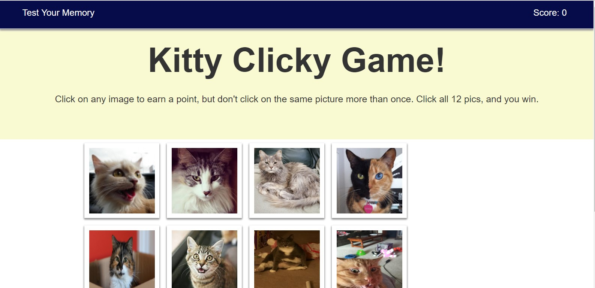
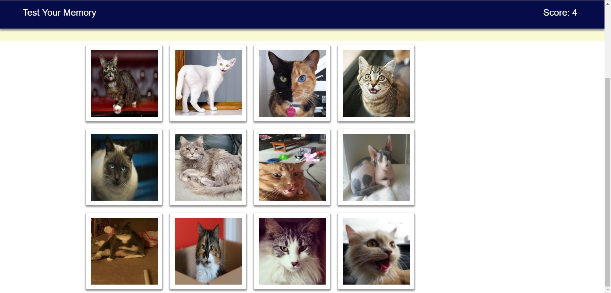

# Kitty Clicky Game

## Overview

This is a memory game using React.

## Instructions

The app will render 12 different kitties to the screen. Click on one and the kitties rearrange randomly. Don't click the same kitty twice!

The app will keep track of your score. Your score will reset to 0 if you click the same kitty twice and the game will restart.

## Technologies used

* React
* ES6
* Bootstrap
* CSS

## Website

https://matheny130.github.io/ClickyGame/
